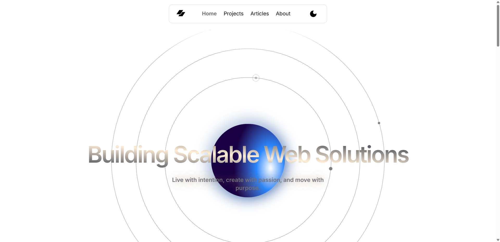
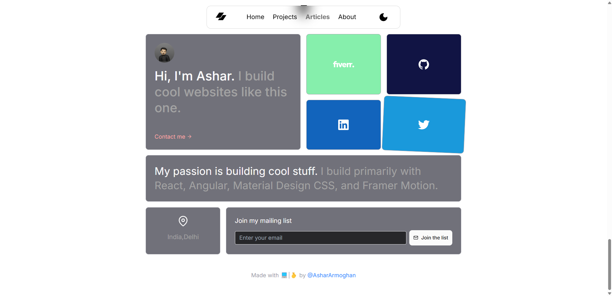
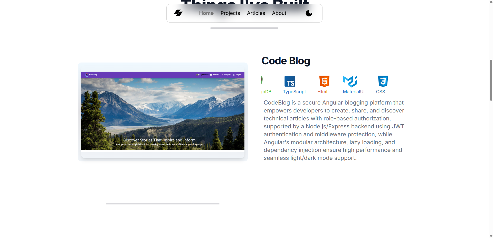

# Portfolio Website 🌐


## Overview ✨

This is a modern and responsive portfolio website built using **Next.js** with **TypeScript**. It leverages static site generation (SSG) with **Next Remote** for efficient and scalable content delivery. The website is designed to showcase projects, skills, and experience in a clean and professional layout.

## Features 🚀

- **Static Site Generation**: Optimized for speed and SEO with Next.js's static site generator.
- **TypeScript**: Ensures type safety and robust development.
- **Responsive Design**: Fully optimized for desktop, tablet, and mobile devices.
- **Dynamic Content**: Fetches project and blog data dynamically using **Next Remote**.
- **SEO Friendly**: Pre-rendered pages with meta tags and Open Graph support.
- **Dark/Light Mode**: User-friendly theme toggle feature.
- **Performance Optimized**: Fast loading times with Next.js and image optimization.

## Tech Stack 🛠️

- **Framework**: [Next.js](https://nextjs.org/)
- **Language**: [TypeScript](https://www.typescriptlang.org/)
- **CSS Framework**: Tailwind CSS
- **Content Delivery**: Next Remote (or a CMS like Contentful/Strapi if used)
- **Hosting**: Vercel
- **Version Control**: Git/GitHub

## Installation and Setup 🏗️

Follow these steps to set up the project locally:

1. **Clone the repository**:
 ```
   git clone https://github.com/your-username/portfolio-website.git
   ```
cd portfolio-website

3. **Install dependencies**:
   ```
   npm install
   ```

5. **Run the development server**:
 ```
   npm run dev
   ```
   Open [http://localhost:3000](http://localhost:3000) in your browser.

6. **Build for production**:
   ```
   npm run build
   npm start
   ```

## Project Structure 📂

```
portfolio-website/
├── public/             # Static assets (images, icons, etc.)
├── src/
│   ├── components/     # Reusable UI components
│   ├── pages/          # Next.js pages (routes)
│   ├── styles/         # Global and component-specific styles
│   ├── utils/          # Helper functions and utilities
│   ├── data/           # Static/dynamic content data
│   ├── types/          # TypeScript type definitions
│   └── config/         # Configuration files
├── .env.local          # Environment variables
├── next.config.js      # Next.js configuration
├── tsconfig.json       # TypeScript configuration
├── package.json        # Project dependencies and scripts
└── README.md           # Project documentation
```

## Deployment 🚢

The project is designed to be deployed on [Vercel](https://vercel.com/):

1. Push the code to a GitHub repository.
2. Connect the repository to Vercel.
3. Configure environment variables in the Vercel dashboard.
4. Deploy the project with a single click.

## Screenshots 📸






## Contributing 🤝

Contributions are welcome! Feel free to fork the repository and submit a pull request.

=======

## Contact 📬

If you have any questions or suggestions, feel free to reach out:

- **Email**: ashararmoghan09@gmail.com
- **Portfolio**: https://ashararmoghan.github.io
- **GitHub**: https://github.com/AsharArmoghan
